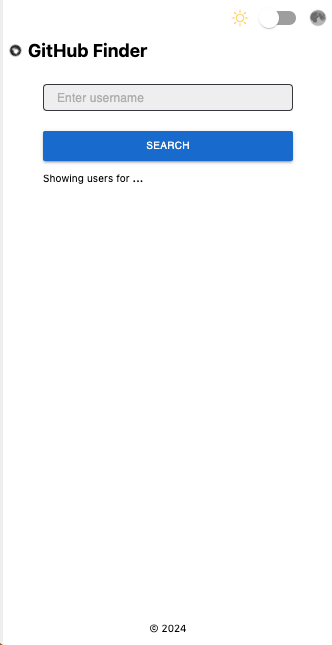

# G-FIND-U
Github repositories explorer

## DEMO
[https://g-find-u.vercel.app/](https://g-find-u.vercel.app/)

## Screenshot


## Core Features
- React
- TypeScript
- Redux (Redux toolkit)
- SASS/SCSS Loader
- CSS Loader
- Image Loader
- Font Loader
- ESLint
- Jest (React Testing Library)
- Cypress
- Webpack & Configuration
- React Fast Refresh + Webpack HMR
- Dark Mode + Light Mode (Theme)
<br />

## Installation

#### To install this project you need to run following commands
<br>
Clone the repository :

```bash
git clone https://github.com/andrIvash/g-find-u.git
```

<br>

Install dependencies using Yarn or NPM :

```bash
# using npm
npm install

# or using yarn
yarn install
```
<br />

## Start : Development

To develop and run your web application, you need to run following command :

```bash
npm start
```
<br />

## Lint : Development

To lint application source code using ESLint via this command :

```bash
npm lint
```
<br />

## JEST : Development

To test application source code using Jest via this command :

```bash
# run cases
npm run test:jest
# watcher
npm run test:jest:watch
#coverage
npm test:jest:coverage
```
<br />

## E2E : Development

To test application source code using Cypress via this command :

```bash
npm run test:cypress
npm run test:cypress:open
```

## Build : Production

Distribution files output will be generated in `dist/` directory by default.

To build the production ready files for distribution, use the following command :

```bash
npm build
```

<br />

## Serve : Production

Serve helps you serve a static site. This command serves build files from `dist/` directory.

```bash
npm serve
```

<br />

## Webpack Configurations

separated `development` and `production` configuration files :

```bash
# Development webpack config
tools/webpack/webpack.config.dev.js

# Production webpack config
tools/webpack/webpack.config.prod.js
```
